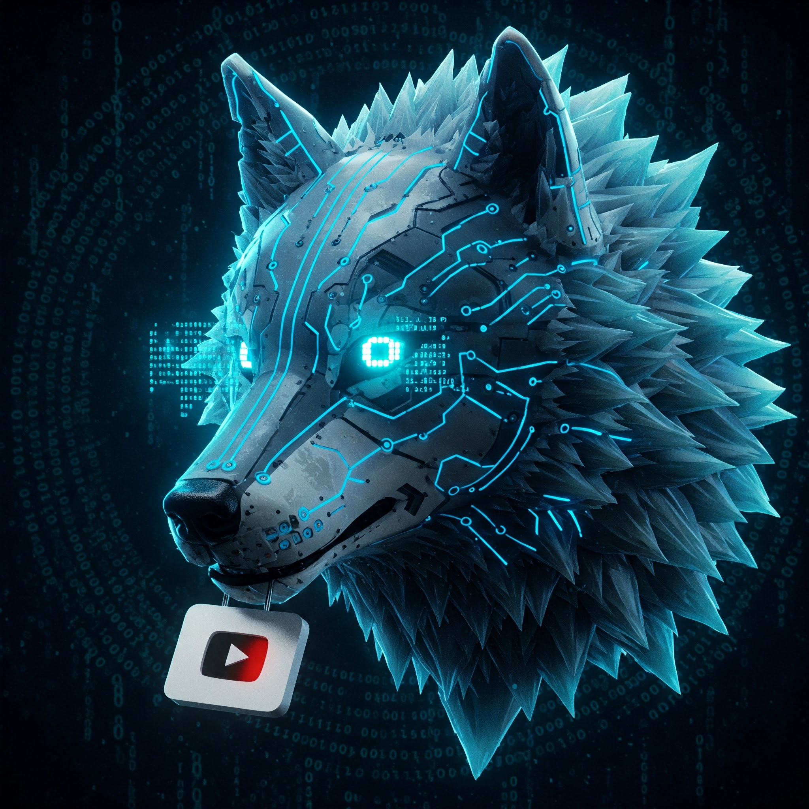

<p align="center">
  
</p>

<h1 align="center">Ariska</h1>

<p align="center">
  <b>Conversão e Download de MP3/MP4 do Youtube</b><br>
  <i>Fullstack: FastAPI + Streamlit</i>
</p>

<p align="center">
  <a href="https://fastapi.tiangolo.com/" target="_blank"></a>
  <a href="https://streamlit.io/" target="_blank"></a>
  <a href="https://www.docker.com/" target="_blank"></a>
  <a href="https://redis.io/" target="_blank"></a>
  <a href="https://pdm.fming.dev/" target="_blank"></a>
  <a href="https://github.com/byMarinho/ariska" target="_blank"></a>
</p>

---

## ✨ Recursos

- Download de vídeos e áudios do Youtube (MP3/MP4)
- Download de playlists completas (zip)
- Seleção de resolução de áudio/vídeo
- Interface web moderna e responsiva (Streamlit)
- API REST robusta (FastAPI)
- Limite de requisições (Rate Limiting via Redis)
- Download temporário seguro (arquivos removidos após uso)
- Deploy local ou via Docker
- Suporte a múltiplos ambientes (desenvolvimento e produção)

---

## 🚀 Tecnologias Utilizadas

- <b>FastAPI</b> — Backend da API
- <b>Streamlit</b> — Frontend web
- <b>Redis</b> — Cache e controle de rate limit
- <b>PDM</b> — Gerenciador de dependências Python
- <b>Docker & Docker Compose</b> — Deploy e orquestração
- <b>Nginx</b> — Proxy reverso e SSL (produção)
- <b>Certbot</b> — Certificados SSL Let's Encrypt

---

## 🖥️ Instalação Local

### Pré-requisitos
- Python 3.11+
- PDM (`pip install pdm`)
- Redis (local ou remoto)

### Passos
```bash
# Clone o repositório
$ git clone https://github.com/byMarinho/ariska.git
$ cd ariska

# Instale as dependências
$ pdm install

# Configure as variáveis de ambiente
$ cp .env.example .env
# Edite o arquivo .env conforme necessário

# Inicie o Redis (se necessário)
$ redis-server &

# Inicie a API
$ pdm run uvicorn src.api.main:app --reload

# Em outro terminal, inicie o app Streamlit
$ pdm run streamlit run src/app/main.py
```

Acesse:
- API: http://localhost:8000
- App: http://localhost:8501

---

## 🐳 Instalação via Docker

### Pré-requisitos
- Docker
- Docker Compose

### Passos
```bash
# Clone o repositório
$ git clone https://github.com/byMarinho/ariska.git
$ cd ariska

# Copie e edite o .env
$ cp .env.example .env

# Suba os containers
$ docker-compose up --build
```

Acesse:
- API: http://localhost:8999 (via Nginx)
- App: http://localhost:8555 (via Nginx)

---

## 📂 Estrutura do Projeto

```
├── src/
│   ├── api/         # Backend FastAPI
│   └── app/         # Frontend Streamlit
├── assets/img/      # Imagens e logo
├── docker-compose.yml
├── .env.example
└── ...
```

---

## 📝 Licença

Distribuído sob a licença MIT. Veja [LICENSE](LICENSE) para mais informações.

---

<p align="center">
  Desenvolvido com ❤️ por <a href="https://bymario.dev" target="_blank">byMario.dev</a>
</p>
